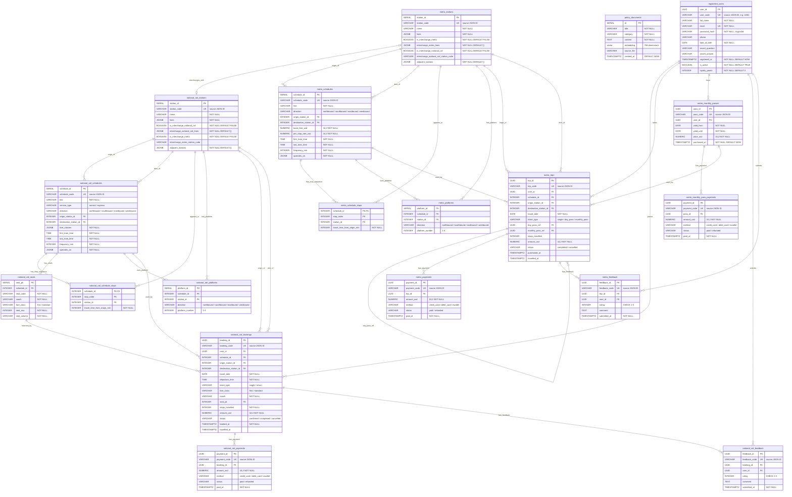

```mermaid
erDiagram
    %% ==========================================
    %% Delete strategy / ON DELETE behaviour
    %% ==========================================
    %% Business records use soft delete / status-based history.
    %% Users use is_active instead of physical deletion.
    %% Bookings, trips, and payments use status to preserve history.
    %% Most business FKs use ON DELETE RESTRICT in schema.sql.
    %% Dependent child rows such as schedule_stops, seats, and platforms use ON DELETE CASCADE.
    %% Optional references such as day_pass_ref use ON DELETE SET NULL.

    %% ==========================================
    %% 1. Users and AI Policy Retrieval Vector
    %% ==========================================

    registered_users {
        UUID user_id PK
        VARCHAR user_code UK "source JSON ID, e.g. U001"
        VARCHAR full_name "NOT NULL"
        VARCHAR email UK "NOT NULL"
        VARCHAR password_hash "NOT NULL, Argon2id"
        VARCHAR phone
        DATE date_of_birth "NOT NULL"
        VARCHAR secret_question
        VARCHAR secret_answer
        TIMESTAMPTZ registered_at "NOT NULL DEFAULT NOW"
        BOOLEAN is_active "NOT NULL DEFAULT TRUE"
        INTEGER loyalty_points "NOT NULL DEFAULT 0"
    }

    policy_documents {
        SERIAL id PK
        VARCHAR title "NOT NULL"
        VARCHAR category "NOT NULL"
        TEXT content "NOT NULL"
        vector embedding "768 dimensions"
        VARCHAR source_file
        TIMESTAMPTZ created_at "DEFAULT NOW"
    }

    %% ==========================================
    %% 2. Infrastructure: Stations and Schedules
    %% ==========================================

    national_rail_stations {
        SERIAL station_id PK
        VARCHAR station_code UK "source JSON ID"
        VARCHAR name "NOT NULL"
        JSONB lines "NOT NULL"
        BOOLEAN is_interchange_national_rail "NOT NULL DEFAULT FALSE"
        JSONB interchange_national_rail_lines "NOT NULL DEFAULT []"
        BOOLEAN is_interchange_metro "NOT NULL DEFAULT FALSE"
        VARCHAR interchange_metro_station_code
        JSONB adjacent_stations "NOT NULL DEFAULT []"
    }

    metro_stations {
        SERIAL station_id PK
        VARCHAR station_code UK "source JSON ID"
        VARCHAR name "NOT NULL"
        JSONB lines "NOT NULL"
        BOOLEAN is_interchange_metro "NOT NULL DEFAULT FALSE"
        JSONB interchange_metro_lines "NOT NULL DEFAULT []"
        BOOLEAN is_interchange_national_rail "NOT NULL DEFAULT FALSE"
        VARCHAR interchange_national_rail_station_code
        JSONB adjacent_stations "NOT NULL DEFAULT []"
    }

    national_rail_schedules {
        SERIAL schedule_id PK
        VARCHAR schedule_code UK "source JSON ID"
        VARCHAR line "NOT NULL"
        VARCHAR service_type "normal / express"
        VARCHAR direction "northbound / southbound / eastbound / westbound"
        INTEGER origin_station_id FK
        INTEGER destination_station_id FK
        JSONB fare_classes "NOT NULL"
        TIME first_train_time "NOT NULL"
        TIME last_train_time "NOT NULL"
        INTEGER frequency_min "NOT NULL"
        JSONB operates_on "NOT NULL"
    }

    metro_schedules {
        SERIAL schedule_id PK
        VARCHAR schedule_code UK "source JSON ID"
        VARCHAR line "NOT NULL"
        VARCHAR direction "northbound / southbound / eastbound / westbound"
        INTEGER origin_station_id FK
        INTEGER destination_station_id FK
        NUMERIC base_fare_usd "10,2 NOT NULL"
        NUMERIC per_stop_rate_usd "10,2 NOT NULL"
        TIME first_train_time "NOT NULL"
        TIME last_train_time "NOT NULL"
        INTEGER frequency_min "NOT NULL"
        JSONB operates_on "NOT NULL"
    }

    national_rail_schedule_stops {
        INTEGER schedule_id PK, FK
        INTEGER stop_order PK
        INTEGER station_id FK
        INTEGER travel_time_from_origin_min "NOT NULL"
    }

    metro_schedule_stops {
        INTEGER schedule_id PK, FK
        INTEGER stop_order PK
        INTEGER station_id FK
        INTEGER travel_time_from_origin_min "NOT NULL"
    }

    %% ==========================================
    %% 3. Seats and Platforms
    %% ==========================================

    national_rail_seats {
        SERIAL seat_pk PK
        INTEGER schedule_id FK
        VARCHAR seat_code "NOT NULL"
        VARCHAR coach "NOT NULL"
        VARCHAR fare_class "first / standard"
        INTEGER seat_row "NOT NULL"
        VARCHAR seat_column "NOT NULL"
    }

    national_rail_platforms {
        SERIAL platform_id PK
        INTEGER schedule_id FK
        INTEGER station_id FK
        VARCHAR direction "northbound / southbound / eastbound / westbound"
        INTEGER platform_number "1-4"
    }

    metro_platforms {
        SERIAL platform_id PK
        INTEGER schedule_id FK
        INTEGER station_id FK
        VARCHAR direction "northbound / southbound / eastbound / westbound"
        INTEGER platform_number "1-4"
    }

    %% ==========================================
    %% 4. National Rail Bookings and Metro Trips
    %% ==========================================

    national_rail_bookings {
        UUID booking_id PK
        VARCHAR booking_code UK "source JSON ID"
        UUID user_id FK
        INTEGER schedule_id FK
        INTEGER origin_station_id FK
        INTEGER destination_station_id FK
        DATE travel_date "NOT NULL"
        TIME departure_time "NOT NULL"
        VARCHAR ticket_type "single / return"
        VARCHAR fare_class "first / standard"
        VARCHAR coach "NOT NULL"
        INTEGER seat_pk FK
        INTEGER stops_travelled "NOT NULL"
        NUMERIC amount_usd "10,2 NOT NULL"
        VARCHAR status "confirmed / completed / cancelled"
        TIMESTAMPTZ booked_at "NOT NULL"
        TIMESTAMPTZ travelled_at
    }

    metro_monthly_passes {
        UUID pass_id PK
        VARCHAR pass_code UK "source JSON ID"
        UUID user_id FK
        DATE valid_from "NOT NULL"
        DATE valid_until "NOT NULL"
        NUMERIC price_usd "10,2 NOT NULL"
        TIMESTAMPTZ purchased_at "NOT NULL DEFAULT NOW"
    }

    metro_trips {
        UUID trip_id PK
        VARCHAR trip_code UK "source JSON ID"
        UUID user_id FK
        INTEGER schedule_id FK
        INTEGER origin_station_id FK
        INTEGER destination_station_id FK
        DATE travel_date "NOT NULL"
        VARCHAR ticket_type "single / day_pass / monthly_pass"
        UUID day_pass_ref FK
        UUID monthly_pass_ref FK
        INTEGER stops_travelled
        NUMERIC amount_usd "10,2 NOT NULL"
        VARCHAR status "completed / cancelled"
        TIMESTAMPTZ purchased_at
        TIMESTAMPTZ travelled_at
    }

    %% ==========================================
    %% 5. Payments and Feedback
    %% ==========================================

    national_rail_payments {
        UUID payment_id PK
        VARCHAR payment_code UK "source JSON ID"
        UUID booking_id FK
        NUMERIC amount_usd "10,2 NOT NULL"
        VARCHAR method "credit_card / debit_card / ewallet"
        VARCHAR status "paid / refunded"
        TIMESTAMPTZ paid_at "NOT NULL"
    }

    metro_payments {
        UUID payment_id PK
        VARCHAR payment_code UK "source JSON ID"
        UUID trip_id FK
        NUMERIC amount_usd "10,2 NOT NULL"
        VARCHAR method "credit_card / debit_card / ewallet"
        VARCHAR status "paid / refunded"
        TIMESTAMPTZ paid_at "NOT NULL"
    }

    metro_monthly_pass_payments {
        UUID payment_id PK
        VARCHAR payment_code UK "source JSON ID"
        UUID pass_id FK
        NUMERIC amount_usd "10,2 NOT NULL"
        VARCHAR method "credit_card / debit_card / ewallet"
        VARCHAR status "paid / refunded"
        TIMESTAMPTZ paid_at "NOT NULL"
    }

metro_monthly_passes ||--o{ metro_monthly_pass_payments : "has_payment"


    national_rail_feedback {
        UUID feedback_id PK
        VARCHAR feedback_code UK "source JSON ID"
        UUID booking_id FK
        UUID user_id FK
        INTEGER rating "CHECK 1-5"
        TEXT comment
        TIMESTAMPTZ submitted_at "NOT NULL"
    }

    metro_feedback {
        UUID feedback_id PK
        VARCHAR feedback_code UK "source JSON ID"
        UUID trip_id FK
        UUID user_id FK
        INTEGER rating "CHECK 1-5"
        TEXT comment
        TIMESTAMPTZ submitted_at "NOT NULL"
    }

    %% ==========================================
    %% Relationships
    %% ==========================================

    %% User relationships
    registered_users ||--o{ national_rail_bookings : "places"
    registered_users ||--o{ metro_trips : "takes"
    registered_users ||--o{ metro_monthly_passes : "buys"
    registered_users ||--o{ national_rail_feedback : "submits"
    registered_users ||--o{ metro_feedback : "submits"

    %% Cross-network interchange relationship
    metro_stations o|--o| national_rail_stations : "interchanges_with"

    %% National rail schedules and stations
    national_rail_stations ||--o{ national_rail_schedules : "origin_of"
    national_rail_stations ||--o{ national_rail_schedules : "dest_of"

    %% N:M between national_rail_schedules and national_rail_stations
    %% is resolved by national_rail_schedule_stops.
    national_rail_schedules ||--o{ national_rail_schedule_stops : "has_stop_sequence"
    national_rail_stations ||--o{ national_rail_schedule_stops : "appears_in"

    national_rail_schedules ||--o{ national_rail_seats : "has_seats"
    national_rail_schedules ||--o{ national_rail_platforms : "uses_platform"
    national_rail_stations ||--o{ national_rail_platforms : "has_platform"

    %% Metro schedules and stations
    metro_stations ||--o{ metro_schedules : "origin_of"
    metro_stations ||--o{ metro_schedules : "dest_of"

    %% N:M between metro_schedules and metro_stations
    %% is resolved by metro_schedule_stops.
    metro_schedules ||--o{ metro_schedule_stops : "has_stop_sequence"
    metro_stations ||--o{ metro_schedule_stops : "appears_in"

    metro_schedules ||--o{ metro_platforms : "uses_platform"
    metro_stations ||--o{ metro_platforms : "has_platform"

    %% National rail bookings
    national_rail_schedules ||--o{ national_rail_bookings : "used_by"
    national_rail_stations ||--o{ national_rail_bookings : "origin_of"
    national_rail_stations ||--o{ national_rail_bookings : "dest_of"
    national_rail_seats ||--o{ national_rail_bookings : "reserved_by"

    %% Metro trips
    metro_schedules ||--o{ metro_trips : "used_by"
    metro_stations ||--o{ metro_trips : "origin_of"
    metro_stations ||--o{ metro_trips : "dest_of"
    metro_trips ||--o{ metro_trips : "day_pass_ref"

    %% Payments
    national_rail_bookings ||--o{ national_rail_payments : "has_payment"
    metro_trips ||--o{ metro_payments : "has_payment"
    metro_monthly_passes ||--o{ metro_trips : "used_by"

    %% Feedback
    national_rail_bookings ||--o{ national_rail_feedback : "has_feedback"
    metro_trips ||--o{ metro_feedback : "has_feedback"
```
